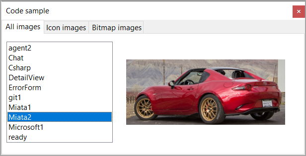

# About

Uses `ResourceLibrary` class project to obtain resource images while the project `ChangeImageCore7` is self-contained.

This project uses .NET Core 7

- Each tab display different images, first tab all images, second only icons and last tab only bitmaps
- All operations utilize a BindingSource so we can change images when a user changes a ListBox selection
- The Bitmap tab uses a BindingList with a BindingSource to dynamically find and position an image as a BindingSource does not support finding data with this data source.

